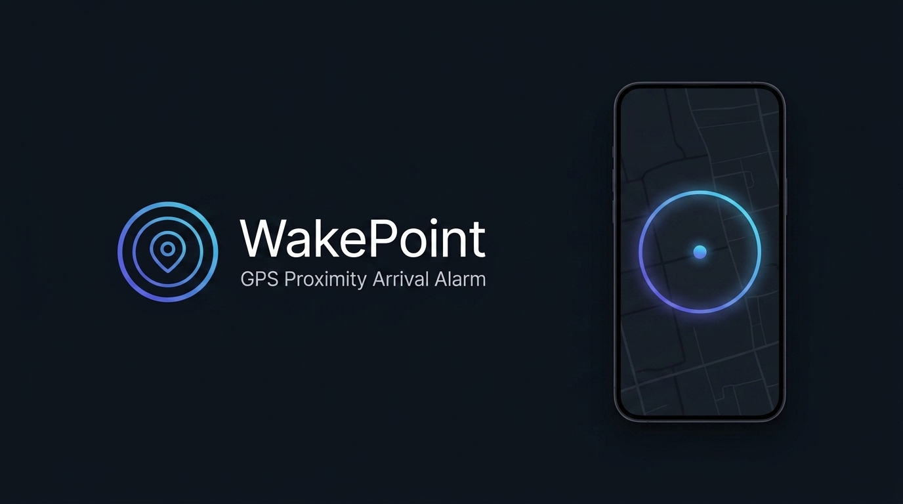
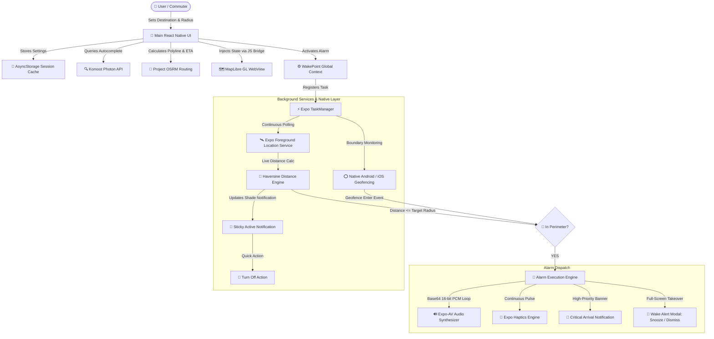
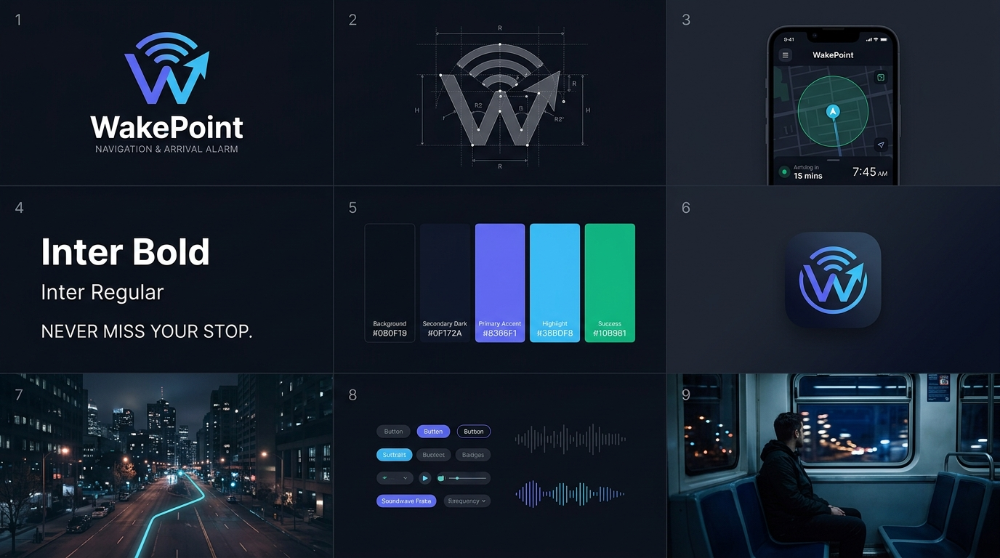

# 📍 WakePoint

<p align="center">
  
</p>

<p align="center">
  <strong>Next-Generation GPS Proximity Arrival Alarm & Vector Dark Map Navigation</strong><br />
  <em>Never miss your transit stop again. WakePoint rings continuous loud alarms and rhythmic haptics the moment you enter your destination perimeter.</em>
</p>

<p align="center">
  <a href="https://expo.dev"></a>
  <a href="https://reactnative.dev"></a>
  <a href="https://react.dev"></a>
  <a href="https://www.typescriptlang.org"></a>
  <a href="https://maplibre.org"></a>
  <a href="LICENSE"></a>
</p>

---

## 💡 The Problem & Solution

Daily commuters, late-night travelers, and passengers on buses, suburban trains, metros, and cabs often want to nap or read without the anxiety of missing their transfer or stop.

- ❌ **Why standard alarms fail**: Clock alarms are strictly time-bound. If your bus gets stuck in traffic or your train stops on an outer track, a timer goes off too early or too late.
- ✅ **The WakePoint difference**: WakePoint is strictly **location-bound (geofenced)**. You specify where you want to wake up and your desired arrival radius (from 100 meters to 5.0 kilometers). WakePoint tracks your real-time GPS coordinates in the background and rings loud, looping alarms and rhythmic vibration pulses the instant you cross into your target perimeter—regardless of route delays.

---

## ✨ Key Features (v1.2.0)

### 🗺️ High-Contrast Dark Vector Map Engine
- **Powered by MapLibre GL v4.7.1 & OpenFreeMap**: Zero Google Maps billing, zero API keys, and zero rate limits.
- **Custom In-Memory Dark Theme**: Calibrated specifically for high outdoor and nighttime contrast with razor-sharp road hierarchies, sapphire water bodies, and crisp typography.
- **Multi-Theme Switcher**: Instant one-tap switching between **Dark Vector**, **Esri World Satellite Imagery**, and **OpenFreeMap Liberty Streets**.
- **Interactive Controls**: Fluid pinch-to-zoom, smooth camera `flyTo` transitions, route bounding, and one-tap re-centering on your live position.

### 🔊 Offline Base64 PCM Audio Synthesis
- **Zero Asset Dependencies**: Synthesizes pure 16-bit PCM WAV audio waveforms dynamically in memory. No missing MP3 asset bugs, zero network streaming delay, 100% offline.
- **4 Distinct Alarm Tones**:
  - 🚨 **Urgent Radar**: Rapid, alternating dual-pitch beeps designed to pierce deep sleep.
  - 📢 **Emergency Siren**: Sweeping frequency modulation for high-urgency wake-ups.
  - 🔔 **Classic Bell**: Harmonic, decaying chimes with realistic acoustic attack.
  - 🎵 **Upbeat Chime**: Bright, pleasant melodic arpeggio.

### 📳 Rhythmic Multi-Pattern Haptic Engine
- **Custom Tactile Pulses**: Three selectable haptic algorithms (**Pulse**, **Heavy**, **Gentle**) using `expo-haptics`.
- **Sleep-Breaking Tactile Feedback**: Cycles through synchronized continuous vibrations alongside the audio engine.

### 🔔 Persistent Notification Shade with Quick Actions
- **Ongoing Foreground Status**: Stays pinned in your notification tray while tracking, showing **live distance remaining** and your arrival perimeter.
- **One-Tap 'Turn Off Alarm' Action**: Dismiss active alarms or tracking directly from the Android lockscreen or notification tray without reopening the app.

### 🛡️ Session Persistence & Crash Resilience
- **Persistent Storage Engine**: Powered by `@react-native-async-storage/async-storage`.
- **Survives Process Eviction**: If Android or iOS evicts the app from RAM or the user restarts their phone, the active destination, radius, and alarm configuration are restored on launch.

### 🔍 Smart Geocoding & Route Navigation
- **Komoot Photon Autocomplete**: Free, lightning-fast search with 300ms debouncing and live GPS coordinate biasing.
- **Live Reverse Geocoding**: Long-press or drag the pin anywhere on the globe to inspect the street address.
- **Turn-by-Turn OSRM Route Navigation**: Fetches live driving polylines, displaying accurate driving distance (km) and estimated travel duration (ETA).
- **🇮🇳 Indian Metro Hub Presets**: Quick-select presets for major transit hubs across Bengaluru, Mumbai, Delhi-NCR, Hyderabad, Chennai, Kolkata, and Pune.

### 🎚️ Dynamic Geofence Radius Slider
- **Granular Adjustments**: Slide smoothly from **100 meters to 5.0 kilometers** (50m increments) with instant visual map circle scaling.
- **Quick Preset Chips**: Jump directly to `250m`, `500m`, `1 km`, `2 km`, or `5 km` with a single tap.

### 🤖 Automated GitHub Actions CI/CD Pipeline
- **Zero-Setup APK Builds**: Pre-configured workflow ([`.github/workflows/build-apk.yml`](.github/workflows/build-apk.yml)) that detects version bumps in `package.json` / `app.json` or Git tag pushes.
- **Auto-Publishing**: Automatically builds, signs, and attaches the installable standalone release `.apk` to GitHub Releases and artifacts.

---

## 🏗️ Architecture & Data Flow



---

## 📱 Tech Stack

| Domain | Technology | Details |
| :--- | :--- | :--- |
| **Framework** | [Expo SDK 54](https://docs.expo.dev/versions/v54.0.0/) | React Native `0.81.5`, React `19.1.0` |
| **Language** | [TypeScript 5.9](https://www.typescriptlang.org/) | Strict mode, complete type safety |
| **Navigation** | [Expo Router v6](https://docs.expo.dev/router/introduction/) | File-based typed routing (`app/`) |
| **Map Rendering** | [MapLibre GL v4.7.1](https://maplibre.org/) via `react-native-webview` | Zero-API key vector maps, Esri Satellite, OpenFreeMap tiles |
| **Audio Engine** | `expo-av` + Custom PCM Synthesizer | In-memory 16-bit WAV generation (4 custom alarm tones) |
| **Haptics** | `expo-haptics` | Hardware-accelerated pulse patterns |
| **Location & Geofence** | `expo-location` + `expo-task-manager` | Foreground location tracking & background geofences |
| **Notifications** | `expo-notifications` | Ongoing sticky tracking notification & high-priority arrival alerts |
| **Storage** | `@react-native-async-storage/async-storage` | Session recovery across app kills and phone reboots |
| **Geospatial APIs** | [Komoot Photon](https://photon.komoot.io/) & [OSRM](http://project-osrm.org/) | Free open-source autocomplete, reverse-geocoding, and routing |
| **CI / CD** | GitHub Actions | Automated Android Release APK compilation & GitHub release publishing |

---

## 🚀 Getting Started

### Prerequisites

- [Node.js](https://nodejs.org/) (version **20.x** LTS or newer recommended)
- `npm` (bundled with Node), `yarn`, or `pnpm`
- **Expo Go** app on your physical device ([Android Play Store](https://play.google.com/store/apps/details?id=host.exp.exponent) or [iOS App Store](https://apps.apple.com/app/expo-go/id982107779)), or an Android Emulator / iOS Simulator.

### 1. Clone the Repository

```bash
git clone https://github.com/vardhineeditharak/WakePoint.git
cd WakePoint
```

### 2. Install Dependencies

```bash
npm install
```

### 3. Start the Development Server

```bash
npx expo start
```

### 4. Run on Your Platform

- **Physical Device**: Scan the QR code displayed in your terminal using **Expo Go** (Android) or the native **Camera app** (iOS).
- **Android Emulator**: Press <kbd>a</kbd> in your terminal (requires Android Studio).
- **iOS Simulator**: Press <kbd>i</kbd> in your terminal (requires macOS and Xcode).
- **Web Browser**: Press <kbd>w</kbd> in your terminal.

---

## 🛠️ Testing Background Location & Alarms

> [!NOTE]
> Persistent background location tasks and foreground services operate under strict OS battery management. While the map and alarms function inside Expo Go, background tracking when the screen is turned off works most reliably on an **Android Development Build** or a **Standalone APK**.

To compile and launch a local native development build on Android:

```bash
# Generate native Android project files
npx expo prebuild --platform android

# Compile and install directly to your connected phone or emulator
npx expo run:android
```

---

## 📦 Building a Standalone Android APK (Free via GitHub Actions)

You do **not** need a local Android Studio installation or a powerful computer to generate installable `.apk` files. WakePoint comes with an automated GitHub Actions CI/CD workflow:

### Option A: Automatic Trigger on Version Update (Recommended)
1. Bump the `"version"` field in [`package.json`](package.json) (e.g. from `1.2.0` to `1.2.1`).
2. Commit and push to `main`:
   ```bash
   git add package.json app.json
   git commit -m "chore(release): bump version to 1.2.1"
   git push origin main
   ```
3. GitHub Actions automatically detects the version bump, compiles the release APK, uploads the artifact, and creates a tagged **GitHub Release** with the APK file attached!

### Option B: Manual Trigger
1. Go to your repository on GitHub and click the **Actions** tab.
2. Select **Build WakePoint Android APK** from the left workflow list.
3. Click **Run workflow** $\rightarrow$ select branch `main` $\rightarrow$ click **Run workflow**.
4. Once completed (~3 to 5 minutes), download the APK under the run's **Artifacts** section or from **Releases**.

---

## 📁 Project Structure

```
WakePoint/
├── .github/
│   └── workflows/
│       └── build-apk.yml            # CI/CD workflow for automated APK releases
├── app/
│   ├── _layout.tsx                  # Root layout, theme provider, and global context injection
│   └── index.tsx                    # Main navigation screen, map viewport, floating search, and dock
├── assets/
│   └── images/
│       ├── brand-banner.png         # Project hero banner
│       ├── brand-guidelines.png     # Visual identity & brand system
│       ├── icon.png                 # App icon
│       ├── splash-icon.png          # App splash screen graphic
│       └── android-icon-*.png       # Android adaptive icon layers
├── components/
│   ├── index.ts                     # Component exports barrel
│   ├── WakeMapView.tsx              # MapLibre GL WebView engine with themes & gesture bindings
│   ├── SearchBar.tsx                # Photon autocomplete, debouncing, & Indian metro hub presets
│   ├── RadiusSliderWidget.tsx       # Bottom drawer with radius slider, ETA display, & alarm toggle
│   ├── AlarmOptionsModal.tsx        # Tone selector (4 PCM waveforms) & vibration style chooser
│   ├── AlarmAlertModal.tsx          # Full-screen ringing arrival alarm with snooze & dismiss
│   └── PermissionModal.tsx          # Graceful location & notification permission prompt
├── constants/
│   ├── index.ts                     # Constants exports barrel
│   ├── theme.ts                     # Color tokens & tile server configurations
│   └── mapDarkTheme.ts              # Custom in-memory high-contrast dark vector map style
├── context/
│   └── WakePointContext.tsx         # Global state: GPS tracking, distance, routes, alarms & permissions
├── services/
│   ├── index.ts                     # Services exports barrel
│   ├── alarmSoundService.ts         # In-memory 16-bit PCM WAV audio synthesizer & expo-av loop engine
│   ├── apiService.ts                # Photon geocoding, reverse geocoding, & OSRM driving routes
│   ├── backgroundTask.ts            # TaskManager foreground service, geofencing & notification shade
│   └── sessionStorage.ts            # AsyncStorage persistence for process-kill recovery
├── app.json                         # Expo configuration, permissions, plugins & background modes
├── package.json                     # Dependencies, scripts & metadata
└── tsconfig.json                    # TypeScript compiler configuration
```

---

## 🔒 Permissions Overview

WakePoint handles permissions transparently through a pre-flight modal:

| Permission | Identifier | Purpose |
| :--- | :--- | :--- |
| **Foreground Location** | `ACCESS_FINE_LOCATION` | Shows your current position on the map, calculates route distance, and draws real-time navigation paths. |
| **Background Location** | `ACCESS_BACKGROUND_LOCATION` | Keeps location tracking active when your phone screen is off or when switching to other apps. |
| **Foreground Service** | `FOREGROUND_SERVICE_LOCATION` | Keeps Android from killing the tracking process during long commutes. |
| **Notifications** | `POST_NOTIFICATIONS` | Displays the ongoing distance notification and rings the high-priority arrival wake-up banner. |
| **Wake Lock** | `WAKE_LOCK` | Keeps the audio and haptic engine pulsing until the user wakes up and dismisses the alarm. |

---

## 🎨 Design & Brand Identity

WakePoint's visual identity balances minimalist dark aesthetics with utilitarian clarity. The logo system uses a precision outer geofence perimeter ring, concentric proximity sonar waves, and a central glowing destination beacon.

<p align="center">
  
</p>

### Color Palette

| Name | Hex | Usage |
| :--- | :--- | :--- |
| **Background Dark** | `#0B0F19` | Main background & map canvas depth |
| **Surface Navy** | `#0F172A` | Floating widgets, search cards, and modal sheets |
| **Primary Indigo** | `#6366F1` | Brand accents, active buttons, and target pins |
| **Success Emerald** | `#10B981` | Safe geofence status, arrival alerts, and confirmed states |
| **Danger Coral** | `#EF4444` | Ringing alarm state, perimeter breach alerts, and dismiss actions |
| **Text Bright** | `#F8FAFC` | High-contrast primary headings and street labels |

---

## 🤝 Contributing

Contributions are what make the open-source community such an amazing place to learn, inspire, and create. Any contributions you make are **greatly appreciated**.

1. Fork the Project
2. Create your Feature Branch (`git checkout -b feat/AmazingFeature`)
3. Commit your Changes (`git commit -m 'feat: add some AmazingFeature'`)
4. Push to the Branch (`git push origin feat/AmazingFeature`)
5. Open a Pull Request

---

## 📄 License

Distributed under the MIT License. See [`LICENSE`](LICENSE) for more information.

<p align="center">
  Built with ❤️ for commuters and travelers everywhere.
</p>
